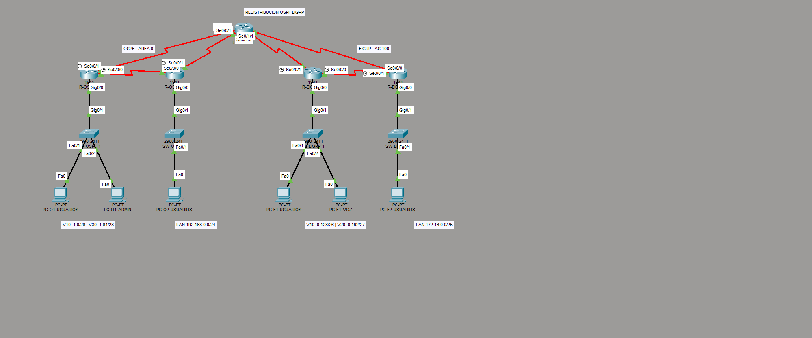

<div align="center">

# Laboratorio 3 · Algoritmos de Enrutamiento

### OSPF · EIGRP · VLSM · VLANs · Redistribución · Balanceo de carga

**Universidad del Valle de Guatemala · CC3067 Redes · Sección 10 · Grupo 1**

| Integrante | Carné |
|:--|:--:|
| Pablo Daniel Barillas Moreno | 22193 |
| Andrés Rafael Chivalán | 21534 |

</div>

---

## Estado del laboratorio

| Indicador | Resultado verificado |
|:--|:--|
| Estado de la topología | ✅ Saludable: 0 enlaces caídos y 0 IP duplicadas |
| Equipos funcionales | ✅ 5 routers, 4 switches y 6 equipos finales |
| Enlaces seriales | ✅ 6 subredes punto a punto `/30` |
| Conectividad estabilizada | ✅ 6 de 6 pruebas representativas, 4/4 respuestas y 0% de pérdida |
| Balanceo OSPF | ✅ ECMP: dos rutas de métrica 21 y reparto 1:1 |
| Balanceo EIGRP | ✅ `variance 3`: relación métrica 3:1, equivalente a 75/25 |
| Redistribución | ✅ Mutua en R-CENTRAL, con métrica semilla hacia EIGRP y rutas OSPF E1 |
| Estado de entrega | ⚠️ Requiere completar los pasos manuales descritos al final |

> [!IMPORTANT]
> La implementación de Packet Tracer es operativa. Sin embargo, el enunciado exige que el PDF 1 se entregue **escrito a mano** y que el PDF 2 contenga **capturas de pantalla** de ping y `tracert`. Los archivos compilados de este repositorio son la base explícita para completar esas evidencias.

## Topología implementada

<p align="center">
  
</p>

La red conserva los cinco routers y las seis conexiones seriales obligatorias. R-CENTRAL participa simultáneamente en OSPF área 0 y EIGRP AS 100, y es el único punto de redistribución.

```text
R-OSPF-1 -------- R-OSPF-2
    \                 /
     \               /
          R-CENTRAL
     /               \
    /                 \
R-EIGRP-1 -------- R-EIGRP-2
```

Los sitios R-OSPF-1 y R-EIGRP-1 utilizan router-on-a-stick; R-OSPF-2 y R-EIGRP-2 poseen una LAN sin VLAN adicional.

## Plan de direccionamiento

### LAN y VLAN

| Dominio | Sitio / segmento | Hosts solicitados | Red asignada | Gateway | Capacidad útil |
|:--|:--|--:|:--|:--|--:|
| OSPF | R-OSPF-2 · usuarios | 200 | `192.168.0.0/24` | `192.168.0.1` | 254 |
| OSPF | R-OSPF-1 · VLAN 10 usuarios | 50 | `192.168.1.0/26` | `192.168.1.1` | 62 |
| OSPF | R-OSPF-1 · VLAN 30 administración | 10 | `192.168.1.64/28` | `192.168.1.65` | 14 |
| EIGRP | R-EIGRP-2 · usuarios | 100 | `172.16.0.0/25` | `172.16.0.1` | 126 |
| EIGRP | R-EIGRP-1 · VLAN 10 usuarios | 60 | `172.16.0.128/26` | `172.16.0.129` | 62 |
| EIGRP | R-EIGRP-1 · VLAN 20 voz | 30 | `172.16.0.192/27` | `172.16.0.193` | 30 |

### Enlaces punto a punto

| Enlace | Subred | Extremo A | Extremo B |
|:--|:--|:--|:--|
| R-OSPF-1 ↔ R-OSPF-2 | `10.0.0.0/30` | `10.0.0.1` | `10.0.0.2` |
| R-OSPF-1 ↔ R-CENTRAL | `10.0.0.4/30` | `10.0.0.5` | `10.0.0.6` |
| R-OSPF-2 ↔ R-CENTRAL | `10.0.0.8/30` | `10.0.0.9` | `10.0.0.10` |
| R-EIGRP-1 ↔ R-EIGRP-2 | `10.0.0.12/30` | `10.0.0.13` | `10.0.0.14` |
| R-EIGRP-1 ↔ R-CENTRAL | `10.0.0.16/30` | `10.0.0.17` | `10.0.0.18` |
| R-EIGRP-2 ↔ R-CENTRAL | `10.0.0.20/30` | `10.0.0.21` | `10.0.0.22` |

No existen solapamientos. Los bloques base respetan lo solicitado: `192.168.0.0/20` para el lado OSPF, `172.16.0.0/20` para el lado EIGRP y `10.0.0.0/24` para enlaces entre routers.

## Resultados de enrutamiento

### OSPF área 0: balanceo de costo igual

En R-OSPF-1, el enlace directo hacia R-OSPF-2 tiene costo 20. El camino alternativo por R-CENTRAL suma 10 + 10 = 20. Al agregar el costo de la interfaz de destino, ambas entradas aparecen con métrica 21:

| Destino | Siguiente salto | Interfaz | Métrica | Reparto |
|:--|:--|:--|:--:|:--:|
| `192.168.0.0/24` | `10.0.0.2` | `Serial0/0/0` | 21 | 1 |
| `192.168.0.0/24` | `10.0.0.6` | `Serial0/0/1` | 21 | 1 |

Resultado: **ECMP 50/50** entre el enlace directo y el camino por R-CENTRAL.

### EIGRP AS 100: balanceo desigual 75/25

Para `172.16.0.0/25` desde R-EIGRP-1 se verificaron estas métricas:

| Camino | Métrica total | Distancia reportada | Función |
|:--|--:|--:|:--|
| Directo a R-EIGRP-2 | 2,170,112 | 2,816 | Successor |
| Vía R-CENTRAL | 6,510,336 | 1,683,712 | Feasible successor |

La condición de factibilidad se cumple porque `1,683,712 < 2,170,112`. Además:

```text
6,510,336 / 2,170,112 = 3
```

Con `variance 3`, EIGRP instala ambos caminos. Como el reparto es inversamente proporcional a la métrica, la relación es 3:1: aproximadamente **75% por la ruta principal y 25% por la secundaria**.

### Redistribución y rutas de resumen

| Dirección | Implementación | Estado |
|:--|:--|:--:|
| OSPF → EIGRP | `redistribute ospf 1 metric 1544 20000 255 1 1500` | ✅ |
| Resumen OSPF hacia EIGRP | `192.168.0.0/23` en las interfaces EIGRP de R-CENTRAL | ✅ |
| EIGRP → OSPF | `redistribute eigrp 100 metric-type 1 subnets` | ✅ |
| Resumen lógico EIGRP | `172.16.0.0/24` | ⚠️ No instalado por limitación del IOS emulado |

Se eligió OSPF **E1** para que la métrica externa incluya también el costo interno hasta R-CENTRAL. El IOS del router 1941 emulado por esta versión de Packet Tracer rechaza `route-map` y no conserva `summary-address` bajo OSPF; por ello, la sumarización EIGRP → OSPF queda documentada y calculada, pero el dominio OSPF recibe las rutas específicas. Esta es la principal desviación técnica frente al requisito estricto.

## Pruebas de conectividad

La batería final, después de resolución ARP, produjo los siguientes resultados reales desde el MCP de Packet Tracer:

| Origen | Destino | Resultado |
|:--|:--|:--:|
| PC-O1-USUARIOS | `172.16.0.2` | ✅ 4/4 · 0% pérdida |
| PC-O1-ADMIN | `172.16.0.194` | ✅ 4/4 · 0% pérdida |
| PC-O2-USUARIOS | `172.16.0.130` | ✅ 4/4 · 0% pérdida |
| PC-E1-USUARIOS | `192.168.0.2` | ✅ 4/4 · 0% pérdida |
| PC-E1-VOZ | `192.168.1.66` | ✅ 4/4 · 0% pérdida |
| PC-E2-USUARIOS | `192.168.1.2` | ✅ 4/4 · 0% pérdida |

Trazas extremo a extremo verificadas:

```text
OSPF → EIGRP
192.168.1.1 → 10.0.0.6 → 10.0.0.21 → 172.16.0.2

EIGRP → OSPF
172.16.0.1 → 10.0.0.22 → 10.0.0.5 → 192.168.1.66
```

## Auditoría de cumplimiento

| Requisito del PDF | Estado | Evidencia / observación |
|:--|:--:|:--|
| 5 routers y 6 enlaces seriales fijos | ✅ | Topología viva: 5 routers y las 6 relaciones exigidas |
| VLSM sin solapamientos | ✅ | Prefijos `/24`, `/25`, `/26`, `/27`, `/28` y seis `/30` |
| VLANs y enrutamiento inter-VLAN | ✅ | Subinterfaces 802.1Q y troncales en los dos sitios indicados |
| OSPF área 0 e interfaces pasivas | ✅ | Tres routers OSPF; solo interfaces seriales no pasivas |
| Balanceo OSPF de costo igual | ✅ | Dos next hops con métrica 21 |
| EIGRP AS 100 e interfaces pasivas | ✅ | Tres routers EIGRP y `passive-interface default` |
| Balanceo EIGRP cercano a 75/25 | ✅ | Successor, feasible successor y `variance 3` |
| Redistribución mutua únicamente en R-CENTRAL | ✅ | Métrica semilla hacia EIGRP y `metric-type 1` hacia OSPF |
| Sumarización en ambas direcciones | ⚠️ Parcial | `/23` OSPF → EIGRP funciona; `/24` EIGRP → OSPF no es admitido por el IOS emulado |
| Evidencia `show ip route` de los 5 routers | ✅ | Incluida en PDF 2 como salida textual |
| Evidencia OSPF pedida como `show ip ospf interface` | ⚠️ | PDF 2 usa `show ip route 192.168.0.0`, que sí muestra los dos next hops; el comando pedido no lista rutas |
| Evidencia EIGRP de topología | ✅ | Incluye successor, feasible successor, FD, RD y justificación de `variance` |
| PDF 1 escrito a mano | ⏳ | La versión LaTeX es la guía completa para transcribir a papel |
| Capturas GUI de ping y `tracert` | ⏳ | Los resultados están transcritos; faltan las capturas literales si el docente las exige |

> [!NOTE]
> El enunciado contiene una inconsistencia: la tabla de roles dice que R-EIGRP-1 lleva **3 VLANs**, mientras que la tabla detallada solo define VLAN 10 y VLAN 20. La implementación sigue la tabla detallada y reserva `172.16.0.224/28` para una tercera VLAN si el docente confirma que debe agregarse.

## Entregables

| Archivo | Contenido |
|:--|:--|
| [PDF1_VLSM_y_Conceptos.pdf](output/pdf/PDF1_VLSM_y_Conceptos.pdf) | Cálculos explícitos de VLSM, tablas y conceptos para transcripción manual |
| [PDF2_Evidencias_Packet_Tracer.pdf](output/pdf/PDF2_Evidencias_Packet_Tracer.pdf) | Tablas de enrutamiento, ECMP, DUAL, redistribución, pings y trazas |
| [Lab3_Algoritmos_Enrutamiento_Grupo1.pkt](packet-tracer/Lab3_Algoritmos_Enrutamiento_Grupo1.pkt) | Topología funcional de Cisco Packet Tracer |
| [PDF1_VLSM_y_Conceptos.tex](latex/PDF1_VLSM_y_Conceptos.tex) | Fuente editable del PDF 1 |
| [PDF2_Evidencias_Packet_Tracer.tex](latex/PDF2_Evidencias_Packet_Tracer.tex) | Fuente editable del PDF 2 |

## Compilación de los documentos

Desde la carpeta `latex`:

```powershell
pdflatex -interaction=nonstopmode -output-directory=../output/pdf PDF1_VLSM_y_Conceptos.tex
pdflatex -interaction=nonstopmode -output-directory=../output/pdf PDF1_VLSM_y_Conceptos.tex
pdflatex -interaction=nonstopmode -output-directory=../output/pdf PDF2_Evidencias_Packet_Tracer.tex
pdflatex -interaction=nonstopmode -output-directory=../output/pdf PDF2_Evidencias_Packet_Tracer.tex
```

La segunda compilación actualiza índices, referencias y numeración.

## Antes de entregar

1. Copiar a mano el contenido de [PDF 1](output/pdf/PDF1_VLSM_y_Conceptos.pdf), mostrando cada potencia de dos, máscara, rango y broadcast.
2. Tomar capturas visibles de un ping y un `tracert` exitosos entre dominios e incorporarlas al PDF 2 si el docente exige evidencia gráfica literal.
3. Confirmar con el docente si R-EIGRP-1 debe tener una tercera VLAN pese a que no aparece definida en la tabla detallada.
4. Explicar la limitación de sumarización EIGRP → OSPF del IOS emulado o, si se permite, usar un modelo/versión de IOS que admita filtrado y resumen externo.
5. Abrir el `.pkt` una última vez, esperar la convergencia y guardar antes de empaquetar los dos PDF y el archivo de Packet Tracer.

---

<p align="center"><sub>Auditoría técnica realizada contra “Lab3 - Algoritmos de Enrutamiento.pdf” y verificada sobre la topología viva en Packet Tracer.</sub></p>
